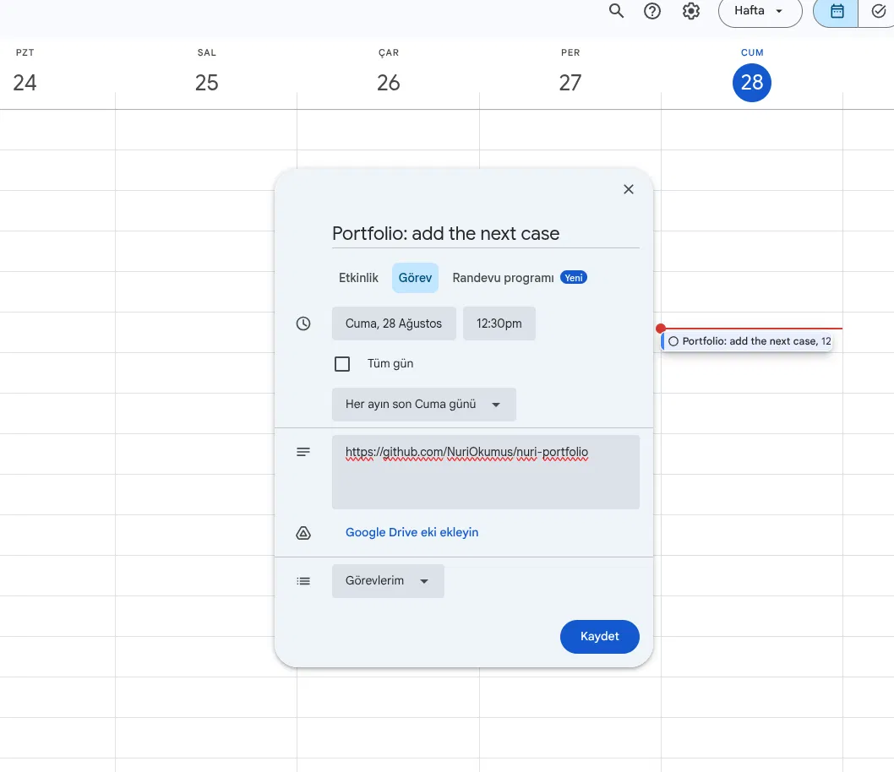
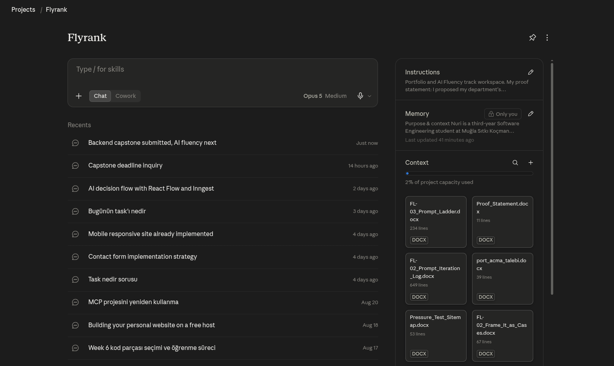

# Adding a second case study

Procedure note for adding another case to this site. Written against the repo as it exists on 2026-08-28. No build step, no framework — this is static HTML with one shared `style.css`, served with directory-based clean URLs (`/work` → `work/index.html`).

## 1. Where the next case goes

The second case is a second `<article class="case-study">` appended inside `work/index.html`, as a sibling of the existing one, inside the same `<main><div class="wrap">`. Insertion point: immediately after the first article's closing `</article>` tag (`work/index.html:247`), before `</div>` / `</main>` (`work/index.html:248-249`).

`/work` does **not** currently need a new route or a new directory. It holds one `<article class="case-study">` end to end — h1, standfirst, architecture figure, `case-section` beats, closing `case-cta`. There is nothing in the CSS that limits the page to one article (see §5), so a second full article stacks under the first on the same URL. This is a deliberate choice to avoid rebuilding `/work` into an index-plus-subpages structure — revisit that restructuring only if a third case shows up; two cases on one page is not worth the churn.

## 2. The three-beat shape

Every beat is a `<section class="case-section">` with a leading `<hr class="rule">`, an `<h2>`, and a `<p>`. Copy this shape exactly for the new case's three core beats.

**The problem** (`work/index.html:148-154`):
```html
<section class="case-section">
  <hr class="rule">
  <h2>The problem</h2>
  <p>Students had nowhere to deploy their coursework. Everyone solved it alone, reaching for whatever
    external service they could find, and some were paying out of pocket for it. The department owned no
    infrastructure of its own.</p>
</section>
```

**What I did** (`work/index.html:156-162`):
```html
<section class="case-section">
  <hr class="rule">
  <h2>What I did</h2>
  <p>Nobody asked me to do this. A new DevOps lab was being set up, so I went to my professors and proposed
    that this be its backbone. They agreed on the spot. I built a five-node K3s cluster &mdash; one control
    plane, four workers &mdash; and the delivery pipeline on top of it.</p>
</section>
```

**What came of it** (`work/index.html:218-234`, text only — figure is optional per beat):
```html
<section class="case-section">
  <hr class="rule">
  <h2>What came of it</h2>
  <p>The system is up and the full flow has been tested end to end. Students have not used it yet, because
    the term has not started. Its first real workload is the department&rsquo;s own website, live on the
    cluster right now.</p>
</section>
```

Note: the live case is not strictly three sections — it inserts three `case-section` "Capability N" beats between "What I did" and "What came of it" (`work/index.html:164-216`), plus an optional closing `<h2>What I&rsquo;d do differently</h2>` beat styled with `class="retro"` (`work/index.html:236-241`, styled at `style.css:244-248`). Use "Capability N" beats only if the case genuinely has multiple independent capabilities to show; skip the retro beat if there's nothing to add yet.

## 3. Step-by-step

1. **`work/index.html`** — after `</article>` of the first case (line 247), add a second `<article class="case-study">…</article>` containing: `<h1>`, optional `<p class="standfirst">`, optional `<figure class="case-figure">` (architecture diagram), the three-beat `case-section`s from §2 (plus any Capability/retro beats), and a closing `<footer class="case-cta">` copied from `work/index.html:243-246`.
2. **`work/index.html:48`** — the first case's standfirst reads "One client, one live engagement, three capabilities I own end to end." The "One client, one live engagement" phrasing reads as a portfolio-wide claim ("this is my only case") once a second case sits below it on the same page. Replace the full sentence with:

   > The department's infrastructure, one live engagement, three capabilities I own end to end.

   This drops the ambiguous "one client" framing, keeps "one live engagement" (still true — it describes this specific engagement, not the whole site), and keeps "three capabilities I own end to end" (still accurate, unrelated to case count).
3. **`work/index.html:8-9`** — the `<meta name="description">` describes only the first case ("I proposed my department's infrastructure..."). Rewrite it to summarize both cases, or make it generic to "case studies" plural.
4. **`work/index.html:7`** — `<title>Work — Nuri</title>` is already generic; no change needed.
5. **`index.html:66`** — `<p class="status">The case study is on the <a href="/work">Work</a> page.</p>` says "The case study" (singular). Change to "The case studies" once a second one exists. This is the only homepage touchpoint for case content — there is no per-case summary block or list on the homepage to extend (see §5).
6. **`style.css`** — add one rule for inter-article spacing (see §5). No other CSS file exists to touch; `style.css` is the only stylesheet, linked identically from every page (`work/index.html:18`).
7. **Nav** — no change. `site-nav` (`work/index.html:35-39`, styled `style.css:94-109`) links pages (`/work`, `/about`, `/contact`), not individual cases. Both cases live under the one `/work` link.
8. **Images** — add new files per §4, reference them from the new article's `<figure>` blocks the same way the first case does.

## 4. Images

Location: flat in `/img/` at repo root (`img/`), **not** `img/projects/` — that subdirectory is local scratch content with zero tracked files (empty dirs only, not part of the site).

Naming: kebab-case, descriptive of the claim being shown, no numbering — e.g. `nodes.png`, `gitea-manifest-tree.png`, `se-website.png`. A `-mobile` suffix variant is used when a separate crop is needed at narrow viewports (`se-website-mobile.png`).

Format: every image ships as a `.png` (or `.jpg` for photos, see `nuri.jpg`) plus a `.webp` sibling of the same basename, served via `<picture>`:
```html
<figure class="case-figure">
  <picture>
    <source srcset="/img/<name>.webp" type="image/webp">
    .png" alt="<one-sentence description of exactly what the capture proves>"
      width="<real-width>" height="<real-height>" loading="lazy">
  </picture>
  <figcaption><name of what the image is, one line.></figcaption>
</figure>
```
For a mobile-specific crop, add a second `<source media="(max-width: 640px)" srcset="/img/<name>-mobile.webp" type="image/webp">` before the default source, matching `work/index.html:226-227`.

`width`/`height` must be the image's real pixel dimensions (get them with `identify <file>` or equivalent before writing the tag — the layout depends on the correct aspect ratio for `loading="lazy"` to reserve space correctly).

Capture standard (apply before any image goes in `/img/`):
- 2x capture, cropped down to just the relevant region — no full-screen chrome.
- Light-theme terminal / light-theme app UI, matching the site's paper background.
- One claim per capture — each image proves exactly one sentence in the figcaption, not a general "here's my screen."
- Screen every capture for student names, addresses, emails, IPs, or tokens before it goes in the repo. This is a public site.

## 5. Anything that would break with two cases

**CSS — one missing rule, nothing else.** `.case-section` (`style.css:225-227`) only sets `margin-top: 64px`, which is internal spacing between beats within one article — it does not create any gap between two sibling `.case-study` articles. Stacking a second `<article class="case-study">` directly after the first will put its `<h1>` right against the first case's `case-cta` footer with no separation. Fix: add
```css
.case-study + .case-study {
  margin-top: 96px;
}
```
to `style.css`. This is the only CSS change needed. I checked for `:first-child`/`:nth-child`/`:last-child` rules scoped to case content and found none tied to `.case-section`, `.case-figure`, or `.case-study` — the `:last-child` rules that exist (`style.css:309`, `style.css:324`) are scoped to `.about-intro` and `.fact-list`, unrelated to `/work`. `.wrap` (`style.css:58-63`, `max-width: 720px`) is a shared column width, not a single-case assumption — it applies fine to two stacked articles.

**Copy, not CSS** — three places assume exactly one case in prose, listed as steps 2, 3, 5 above (`work/index.html:48` standfirst, `work/index.html:8-9` meta description, `index.html:66` homepage status line). These will read as factually wrong once a second case exists if left unedited — they won't break rendering, but they'll be lying.

**Two `<h1>`s on one page.** Once the second `<article class="case-study">` is appended, `work/index.html` will have two `<h1>` elements. This is valid HTML5 (each `<article>` is sectioning content with its own outline) but is a known accessibility/SEO tradeoff worth being aware of — not fixing it, just flagging it as a deliberate acceptance.

**Not affected:** the homepage proof strip (`index.html:51-65`, `data-proof` attributes) and its live-fetch script (`index.html:77-150`, hitting `/api/cluster-status`) are wired to the first case's live cluster metrics only. Nothing about a second case requires touching that script or endpoint.

## 6. The next case: K3s triage agent

Pre-filled shape for the case I already know is coming — TriageMcp.

**The problem** — [write once scoped: what was slow/manual/risky about diagnosing issues on the department K3s cluster before this existed.]

**What I did** — Built TriageMcp, a Go MCP server exposing eight read-only tools against the department K3s cluster, driven by an n8n agent workflow. Advisory-only: it reads and reports, it does not mutate cluster state.

**What came of it** — [PLACEHOLDER — fill in after the tool has been used for real triage: time saved, a specific incident it helped diagnose, or its current status if not yet load-bearing.]

Captures to collect before writing this case (apply the standard in §4 — screen for student data before use):
- The MCP tool list output — all eight tools named, one capture, proving the read-only tool surface.
- The n8n workflow canvas — the agent graph, showing it's orchestration, not a single script.
- One real triage exchange (prompt → tool calls → advisory output) — the clearest single proof that this is advisory-only, not another `kubectl` wrapper with write access.
- Optionally: the Go repo's file tree in Gitea, matching the pattern already used for the GitOps case (`work/index.html:195-203`, `gitea-manifest-tree.png`), if the source lives there too.

## 7. Reminder and build context

A recurring calendar reminder is set to add this case.


The Claude Project already holds my voice, stack and identity kit, so the next case is a conversation and not a rebuild.

